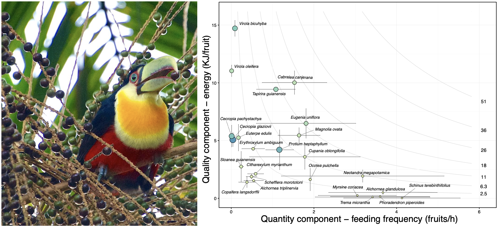

## MS_JEcol_Resource-provisioning-effectiveness

This is a public repository for the data, analysis, and code included in our paper:

Quintero E., Pizo M.A., Jordano P. 2020. Fruit resource provisioning for avian frugivores: the overlooked side side of effectiveness in seed dispersal mutualisms. *Journal of Ecology* **108 (4)**:  1358-1372.

Using a sample of Atlantic rainforest avian frugivores we analyze fruit effectiveness as a nutritional food resource for seed dispersing birds, i.e., Resource-Provisioning Effectiveness (RPE), an overlooked aspect of seed dispersal effectiveness. We found ample variation in RPE among plant species, given not just variation in fruit design and nutrient content but also in fruit availability, accessibility and other features that determine how rewarding a fruit resource is for the frugivore. Yet fruit species show consistent RPE values despite highly variable outcomes of interactions with different avian frugivores.

This repository is for data maintenance and update. The permanent repository associated with the paper is in [DRYAD](https://datadryad.org/stash/dataset/doi:10.5061/dryad.pk0p2ngj7). 
